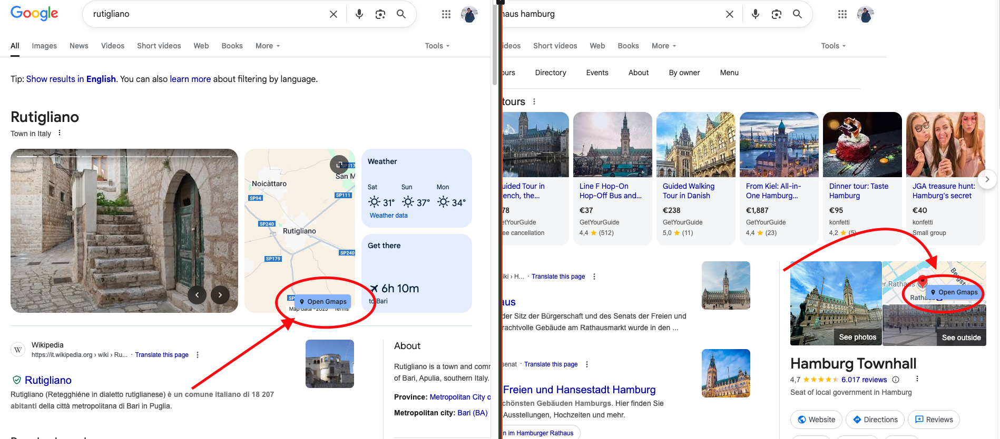

# GMaps Link

*Enhanced version based on [gsearch-gmaps-link](https://github.com/rhozacc/gsearch-gmaps-link) by rhozacc*

Like many users, I felt a bit frustrated that clicking map boxes in Google Search results no longer opens Google Maps
directly. This extension restores that functionality and extends it to work on any website with embedded maps.

When you encounter a map on any webpage, this extension adds a simple "Google Maps" button and makes the map clickable
to open the location in Google Maps.

## Why This Extension Exists

The EU's [Digital Markets Act (DMA)](https://www.whitecase.com/insight-alert/digital-markets-act-dma-goes-live) requires
Google to reduce anti-competitive practices and prevent monopolization of search through integration with other Google
products. While I do understand the regulatory intention to protect digital competition, this is an example of regulations that
impact negatively the UX. Many users feel this has significantly worsened their experience with Google Search.

The removal of direct Google Maps integration from search results means users now face extra clicks and insane overhead to
access a feature they relied on daily. Based on conversations with fellow users, this feels like losing an important,
convenient feature that made web browsing more efficient.

This extension restores that lost functionality while respecting the regulatory landscape - it simply gives users back
the choice and convenience they want.

## Features

- **Google Search Maps**: Click map boxes in search results to open Google Maps (original functionality)
- **Universal Maps**: Works on any website with embedded maps (restaurants, real estate, events, etc.)

## Installation

### Method 1: Manual Installation (Recommended)

1. Download or clone this repository
2. Go to `chrome://extensions`
3. Enable **Developer Mode** (toggle in top right)
4. Click **Load unpacked** and select the extension folder
5. The extension icon should appear in your Chrome toolbar

### Method 2: Chrome Web Store

*Coming soon*

## Settings

- **Open in New Tab**: Choose whether Google Maps opens in new tab or current tab
- **Confirmation Dialog**: Optional confirmation before opening Google Maps
- **Custom Selectors**: Add your own CSS selectors to detect maps on other websites

## Privacy

- Zero data collection or tracking (code is open source, check it yourself if you like ;) )
- All processing happens locally in your browser
- Only opens Google Maps when you click - no automatic connections

## Credits

Based on the original [gsearch-gmaps-link](https://github.com/rhozacc/gsearch-gmaps-link)
by [rhozacc](https://github.com/rhozacc).

Enhanced with universal map detection, accessibility improvements, and modern Chrome extension
standards.

## License

MIT License, see [LICENSE](LICENSE) file for details.

Made with ❤️ by [amasotti](https://github.com/amasotti) - feel free to contribute or suggest improvements!
